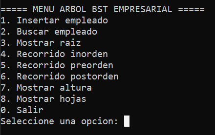
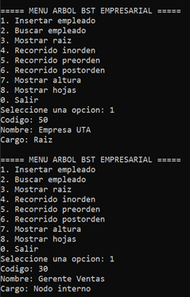
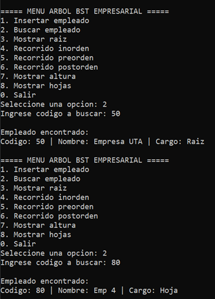
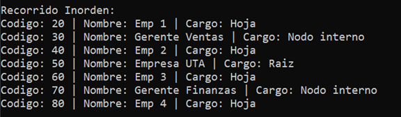
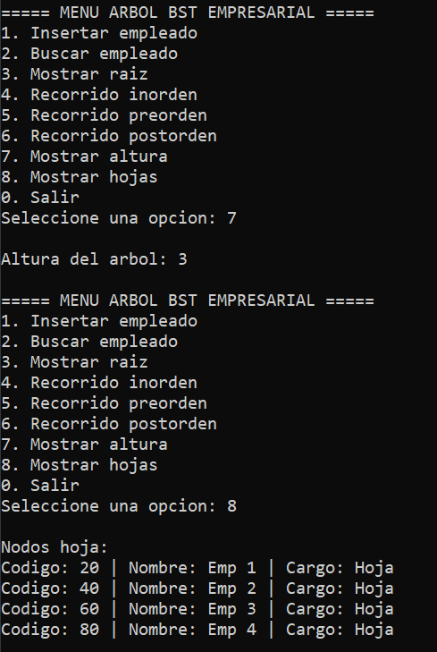

# Árbol BST Empresarial en C++

**Asignatura:** Estructura de Datos  
**Tema:** Árboles Binarios de Búsqueda (BST)  
**Trabajo:** Individual  
**Integrante:** JeampyON  

## Objetivo

Implementar en C++ un Árbol Binario de Búsqueda (BST) para organizar los empleados de una empresa usando un código numérico como clave. El proyecto refleja la estructura de un organigrama empresarial, identificando raíz, niveles, nodos internos y hojas.

### ¿Qué es un Árbol Binario de Búsqueda (BST)?

Un BST es una estructura de datos jerárquica donde cada nodo puede tener como máximo dos hijos: uno izquierdo y uno derecho. La regla principal es que todos los valores menores al nodo actual se ubican a la izquierda, y todos los mayores a la derecha. Esto permite realizar búsquedas de forma eficiente.

### Conceptos clave
**Raíz:** El primer nodo del árbol, desde el cual se originan todos los demás. No tiene padre. En este proyecto, representa la empresa principal.
**Nodo interno:** Un nodo que tiene al menos un hijo. En el organigrama, representan gerentes o jefes de área.
**Hoja**: Un nodo que no tiene hijos (ni izquierdo ni derecho). Representa a los empleados sin subordinados. 
**Nivel:** La profundidad de un nodo dentro del árbol. La raíz está en el nivel 0, sus hijos en el nivel 1, y así sucesivamente. 
**Altura:** El número total de niveles del árbol. Se calcula desde la raíz hasta la hoja más profunda.

### Recorridos del árbol

- **Inorden (Izquierda → Raíz → Derecha):** Muestra los empleados en orden ascendente según su código.
- **Preorden (Raíz → Izquierda → Derecha):** Muestra la raíz primero, útil para copiar la estructura del árbol.
- **Postorden (Izquierda → Derecha → Raíz):** Muestra los hijos antes que el padre, útil para eliminar nodos.

---

## Funcionalidades

- Insertar empleados con código, nombre y cargo
- Buscar un empleado por código
- Mostrar la raíz del árbol
- Recorrido inorden
- Recorrido preorden
- Recorrido postorden
- Calcular la altura del árbol
- Mostrar los nodos hoja

## Estructura del Repositorio

arbol-bst-empresa-cpp/
├── README.md
├── src/
│   └── main.cpp
└── capturas/
    ├── menu_principal.png
    ├── insercion.png
    ├── busqueda.png
    ├── recorridos.png
    └── altura_hojas.png

## Datos de Prueba

Los siguientes empleados fueron utilizados para probar el funcionamiento del árbol:

| Código | Nombre | Cargo |
|---|---|---|
| 50 | Empresa UTA | Raíz |
| 30 | Gerente Ventas | Nodo interno |
| 70 | Gerente Finanzas | Nodo interno |
| 20 | Emp 1 | Hoja |
| 40 | Emp 2 | Hoja |
| 60 | Emp 3 | Hoja |
| 80 | Emp 4 | Hoja |

Al insertar estos datos, el árbol queda con la siguiente forma:

```
          50 (Empresa UTA)
         /                \
     30 (Gerente V.)    70 (Gerente F.)
     /        \          /          \
  20(Emp1)  40(Emp2)  60(Emp3)   80(Emp4)
```

## Capturas de Ejecución

### 1. Menú Principal


### 2. Inserción de Empleados


### 3. Búsqueda de Empleado


### 4. Recorridos (Inorden, Preorden, Postorden)


### 5. Altura y Nodos Hoja



## ▶️ Cómo Compilar y Ejecutar

### Requisitos
- Compilador g++ (MinGW en Windows)

### Pasos

```bash
# Entrar a la carpeta src
cd src

# Compilar
g++ main.cpp -o arbol

# Ejecutar
arbol.exe
```

---

## Conclusión

La implementación del Árbol Binario de Búsqueda permitió comprender de forma práctica cómo se organiza información jerárquica en estructuras de datos. A través del organigrama empresarial, fue posible identificar claramente los conceptos de raíz, nodos internos, hojas, niveles y altura. Los recorridos inorden, preorden y postorden demostraron cómo la forma de visitar los nodos cambia el orden de los resultados, cada uno con una utilidad distinta. Esta estructura es especialmente eficiente para búsquedas, ya que reduce el número de comparaciones necesarias al aprovechar el orden jerárquico de los datos.
